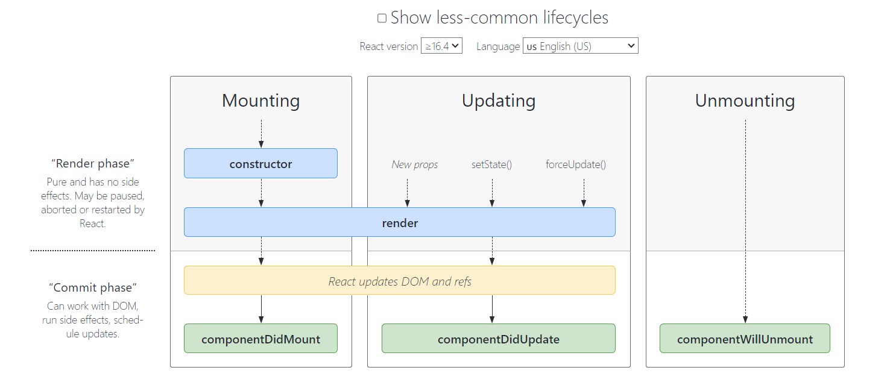

# Life Cycles



>- ***There are Three Stages - Mounting , Updating & Unmounting*** 
>- ***In each stage there are two phases - Render & commit***
>   - ***Render Phase(Reconciliation Phase)***
>       - Component initialization with dummy data
>       - Component rendered or mounted to dom with dummy data
>       - Reconciliation happens in this phase
>       - render method is used in class component and returing the JSX in functional component
>       - keep track of new components
>       - use singly linked list to traverse
>       - uses async operations , can stop and start any time
>   - ***Commit Phase***
>       -  Dom updation happens in this phase
>       -  cannot be stopped
>       -  update DOM in small chunks for concurrency
>       -  It do the batch updates to the DOM for Optimized performace
>       -  we can do side effect in this phase like fetching API's , etc
>       -  we use componentdidMount , componentDidUpdate , componentWillUnmount in class components and useEffect in functional components
>- ***When we call setState the updating stage will be called***
>- ***componentWillUmount will be called when the component leave the DOM***
>- ***We can use componentWillUnmount  , useEffect will be use for clearing event , timeout and intervals***

# Class components and its life cycles
```javascript
            class About extends Component {
                //STEP 1 : intializing VDOM with dummy data
                constructor(props) {
                    super(props);
                    //console.log("Parent - constructor");
                }

               //STEP3 : COMMIT PHASE
                componentDidMount() {
                    // Best place to make an Api call
                    //console.log("Parent - componentDidMount");
                }
               //STEP2 : Reconciliation or render phase
                render() {
                    //console.log("Parent - render");
                    return (
                    <div>
                        <h1>About Us Page</h1>
                        <p>
                        This is the Namaste React Live Course Chapter 07 - Finding the Path 🚀
                        </p>
                        <Child1/>
                        </Child2/>
                        
                    </div>
                    );
                 }
                }

```
***Output***
         
>- ***Parent Constructor***
>- ***Parent render***
>   - ***First Child constructor***
>   - ***First Child render***
>   - ***Second Child constructor***
>   - ***Second Child render***
>   - ***first Child componentDidMount***
>   - ***Second Child componentDidMount***
>- ***Parent componentDidMount***


## Example of using all life cycle method in class components
```javascript
        import React from "react";
        class Profile extends React.Component {
        constructor(props) {
            super(props);
            // Create State
            this.state = {
            userInfo: {
                name: "Dummy Name",
                location: "Dummy Location",
            },
            };
            //console.log("Child - Constructor" + this.props.name);
        }
        componentDidMount() {
            this.timer = setInterval(() => {
            console.log("NAMASTE REACT OP ");
            }, 1000);
            //console.log("Child - componentDidMount");
        }
        componentDidUpdate(prevProps, prevState) {
            if (this.state.count !== prevState.count) {
            //
            }
            if (this.state.count2 !== prevState.count2) {
            // code
            }
            console.log("Component Did Update");
        }
        componentWillUnmount() {
            clearInterval(this.timer);
            //console.log("ComponentWillUnmount");
        }
        render() {
            const { count } = this.state;
            //console.log("Child - render" + this.props.name);
            return (
            <div>
                <h1> Profile Class Component </h1>
                
                <h2>Name: {this.state.userInfo.name}</h2>
                <h2>Location: {this.state.userInfo.location}</h2>
            </div>
            );
        }
        }
```

>- ***React Hooks is not a migic , its just an arrays [READ](https://medium.com/@ryardley/react-hooks-not-magic-just-arrays-cd4f1857236e)***
>- ***Please note useEffect will only called component render***

## useState

>- ***Normal javascript variable won't sustains it values during component rendering's, because as react component is nothing but functions***
>- ***What happens when the function removed from callstack and called again ?***
>   - ***Function will lose its whole execution context and lose its entire data***
>- ***useState is the special hook in react which is used to store variable and its sustains values for consequtive renederings***
>- ***useState returns array of two values one is vairable which the values is store and function which can manipulate the variable***


## useEffect

>- ***useEffect Hook is special hook which is used to achive asyn operation or side effects in the components***
>- ***useEffect can be used in multiple ways to achieve different behaviours***
>- ***useEffect takes two params , one is callback function & dependency array***


>- ***useEffect with empty dependency array***
>   - ***The code inside it will be called only at intial render of the component***
>   - ***Intial fetch calls during at intial page loadings***

>- ***useEffect with no dependency array***
>   - ***The code inside useffect will run for every subsequent renders***
>   - ***We will use it mostly to update the component state based on user interactions***
>   - ***Please note usage of setmethods/ improper update the variable will leads to infinte loops***


>- ***useEffect with  values inside  dependency array***
>   - ***The code inside useEffect only run when the variable inside dependency array change***


>- ***umount phase***
>   - ***Its return an function in useEffect***
>   - ***We can use / write some code in  the return function to clear the eventhandlers or heavy operation once its work is done***

```javascript
        import { useEffect, useState } from "react";

        export const LifeCycles = () => {

        <!-- initialization phase react hooks uses useState insted of constructor -->
        const [data, setData] = useState("hello");

        <!-- useEffect usage -->
        <!-- shouldcomponentUsage in react.memo.js file -->
        <!-- componentDidMount() in hooks -->

        useEffect(() => {
            setData("rendered");
            console.log("componenetdidmount ran with [] dependency");
        }, []);

        <!-- Below log will appear first -->
        console.log("rendering outside "); 

        <!-- componenentDidUpdate in hooks -->

        useEffect(() => {
            console.log("componenetdidUpdate ran without dependency");
            <!-- we should never call setData inside useEffect with proper dependency array - it will lead to infinte array. -->
            <!-- setData("componenetdidUpdate ran without dependency"); -->
        });

        useEffect(() => {
            console.log("componenetdidUpdate ran", data);
        }, [data]);

        <!-- component will ummount  in hooks -->

        useEffect(() => {
            return () => {
            <!-- setData("component will unmount"); -->
            console.log("component will unmount");
            };
        });

        return <div>{data}</div>;
        };
```


## making fetch request using useEffect hook
```javascript
        import {useState , useEffect} from 'react';

        <!-- intial loading of state which empty object -->
        const [data,setData]  = useState({}); 

        <!-- making fetch request to api -->
        const getData = async () => {
            const data = await fetch("https://sample.com")
            const resp = await data.json();
            setData(resp);
        }

         <!-- do your side effect or async operations here -->
        useEffect(() => {
            getData()
        },[])

        return (
            <div> 
                {data.map((item) => <li key={item.id}>{item.name} </li>)}
            </div>
        )
```
