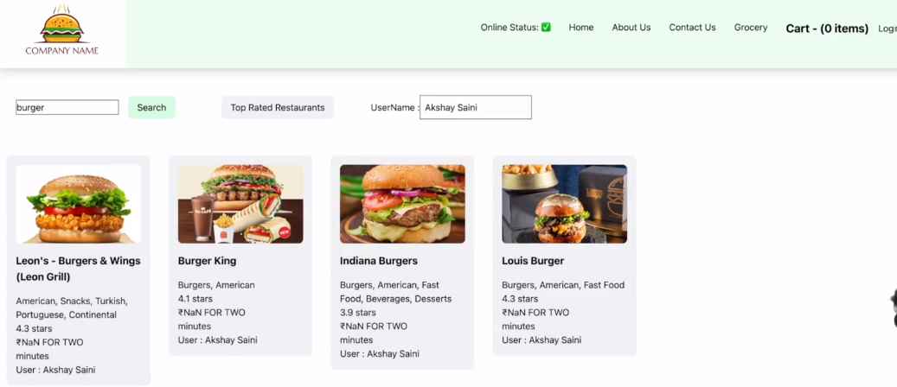
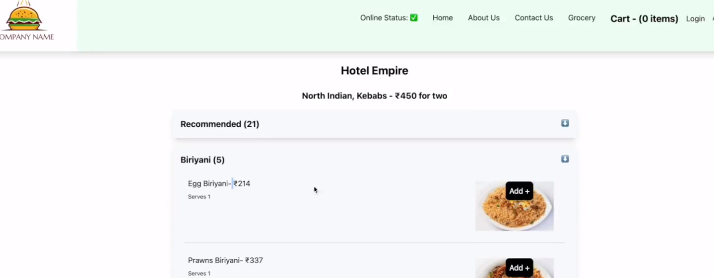

# Testing

>-  We will using React Testing Library  builds on top of DOM Testing library. 

***setting up testing in app***
>- npm install --save-dev @testing-library/react
>- npm install --save-dev jest
>- npm install --save-dev babel-jest @babel/core @babel/preset-env
>- configure babel
        <!-- babel.config.js -->
            module.exports = {
            presets: [['@babel/preset-env', {targets: {node: 'current'}}]],
            };
>- configure paracel/ webpack to disable default babel traspilation 

        <!-- .parcelrc -->
        {
            "extends": "@parcel/config-default",
            "transformers": {
                "*.{js,mjs,jsx,cjs,ts,tsx}": [
                "@parcel/transformer-js",
                "@parcel/transformer-react-refresh-wrap"
                ]
            }
            }
>-  Jest configuration -> npx jest --init
>-  We should JSDOM as an environment . As we can't run our test cases directly on browser , JSDOM create browser like environment to execute test cases.
>-  Install JSDOM libarary (if we are using jest greater than 28 we need to install JSDOM seperatly).
>       - npm i -D jest-environment-jsdom
>- Install preset React to make jsx work in testing libaray and include it in babel config
>       - npm i -D @babel/preset-react
>-  Install @testing-library/jest-dom - to access jsdom elements
> - Add HRM to test -> "watch-test": "jest--watch" in scripts of package.json

## Unit Test cases  examples 
>- ***In Every test case we will do three things***
>   - render , Querying , Assert
>   - it or test are same 

### sum of two variable

***sum.js***
        export const sum = (a, b) => {
            return a + b;
        };
        
***___test__/sum.test.js***

        import { sum } from "../sum";

        test("sum of two variable", () => {
            const result = sum(5, 6);
            expect(result).toBe(11);
        });

### Basic form testing 

***contactus.js***

        export const ContactUs = () => {
            return (
                

                    <h1> Contantus  Form</h1>
                    <input type="text" placeholder="name"></input>
                    <input type="text" placeholder="age"></input>
                    <button>Submit</button>
                

            )
        }

***contactus.test.js***

        import { render,screen } from "@testing-library/react";
        import { ContactUs } from "../components/contantus";
        import "@testing-library/jest-dom"; // its is used for assertion

        // describe is used for grouping of test cases
        describe("contact us form test cases" , ()=> {
            beforeAll(()=> {
                console.log("before all)
            })

             beforeEach(()=> {
                console.log("before Each)
            })

            it('should load contact us component', () => { 
                render(<ContactUs/>)  // its render contact us to JSDOM
                const heading = screen.getByRole("heading");
                expect(heading).toBeInTheDocument();
            })
            
            it('should load  button  inside contanctus component', () => { 
                render(<ContactUs/>)  // its render contact us to JSDOM
                // const button = screen.getByRole("button");
                const button = screen.getByText("Submit");
                expect(button).toBeInTheDocument();
            })
            
            it('should load  input  inside contanctus component', () => { 
                render(<ContactUs/>)  // its render contact us to JSDOM
                const inputname = screen.getByPlaceholderText("name")
                expect(inputname).toBeInTheDocument();
            })
            
            it('should load  two input  fields inside contanctus component', () => { 
                //rendering
                render(<ContactUs/>)  // its render contact us to JSDOM
                //Querying
                const inputboxes = screen.getAllByRole("textbox") // when you do get all  it will array of objects
                //Assertion
                expect(inputboxes.length).toBe(2);
            })
            
        })

### Testing header component which is using Redux & context(RouterDom , etc..)

        import { fireEvent, render, screen } from "@testing-library/react";
        import { Provider } from "react-redux";
        import appStore from "../../utils/appStore";
        import Header from "../Header";
        import { BrowserRouter } from "react-router-dom";
        import "@testing-library/jest-dom";

***Should render Header Component with a login button***

        it("Should render Header Component with a login button", () => {
            render(
                <BrowserRouter>
                <Provider store={appStore}>
                    <Header />
                </Provider>
                </BrowserRouter>
            );

            const loginButton = screen.getByRole("button", { name: "Login" });

            //const loginButton = screen.getByText("Login");

            expect(loginButton).toBeInTheDocument();
        });

***Should render Header Component with a Cart items 0***

        it("Should render Header Component with a Cart items 0 ", () => {
            render(
                <BrowserRouter>
                <Provider store={appStore}>
                    <Header />
                </Provider>
                </BrowserRouter>
            );

            const cartItems = screen.getByText("Cart - (0 items)");

            expect(cartItems).toBeInTheDocument();
        });

***Should render Header Component with a Cart item using regex***

        it("Should render Header Component with a Cart item ", () => {
            render(
                <BrowserRouter>
                <Provider store={appStore}>
                    <Header />
                </Provider>
                </BrowserRouter>
            );

            const cartItems = screen.getByText(/Cart/);

            expect(cartItems).toBeInTheDocument();
        });

***Should change Login Button to Logout on click***

        it("Should change Login Button to Logout on click", () => {
            render(
                <BrowserRouter>
                <Provider store={appStore}>
                    <Header />
                </Provider>
                </BrowserRouter>
            );

            const loginButton = screen.getByRole("button", { name: "Login" });

            fireEvent.click(loginButton);

            const logoutButton = screen.getByRole("button", { name: "Logout" });

            expect(logoutButton).toBeInTheDocument();
        });

### Testing component which having props data

        import { render, screen } from "@testing-library/react";
        import RestaurantCard from "../RestaurantCard";
        import MOCK_DATA from "../mocks/resCardMock.json";
        import "@testing-library/jest-dom";

        it("should render RestaurantCard component with props Data", () => {
             render(<RestaurantCard resData={MOCK_DATA} />);

            const name = screen.getByText("Leon's - Burgers & Wings (Leon Grill)");

            expect(name).toBeInTheDocument();
        });

        it("should render RestaurantCard component with Promoted Label", () => {
             // Home Work - test HOC : withPromtedLabel()
        });

## Integration Testing

>- ***Test Case Steps**
>   - ***As soon as page load page should conatins cards greater than 10***
>   - ***Check for search bar component***
>   - ***Type in search and click search button***
>   - ***After clicking search button page should reflect respective card***
>   - ***mocking fetch function***
>       -   we can fetch the from test env , so that we need to mock it similar to fetch function
>   -  ***whenever there is updation of state in component we need to use act function from react-dom/test-utils***

***imports***

        import { fireEvent, render, screen } from "@testing-library/react";
        import { act } from "react-dom/test-utils";
        import Body from "../Body";
        import MOCK_DATA from "../mocks/mockResListData.json";
        import { BrowserRouter } from "react-router-dom";
        import "@testing-library/jest-dom";

***mocking fetching function***

        global.fetch = jest.fn(() => {
        return Promise.resolve({
            json: () => {
            return Promise.resolve(MOCK_DATA);
            },
        });
        });

***Should Search Res List for burger text input ***
***whenever there is updation of state in component we need to use act function from react-dom/test-utils***

        it("Should Search Res List for burger text input ", async () => {
            await act(async () =>
                render(
                <BrowserRouter>
                    <Body />
                </BrowserRouter>
                )
            );

            <!-- As soon as page load page should conatins cards greater than 10 -->
            const cardsBeforeSearch = screen.getAllByTestId("resCard");
            expect(cardsBeforeSearch.length).toBe(20);

            <!-- find the search button -->
            const searchBtn = screen.getByRole("button", { name: "Search" });
            const searchInput = screen.getByTestId("searchInput");

            <!-- firing onchange event in search bar  with value burger and checking res cards -->
            fireEvent.change(searchInput, { target: { value: "burger" } });
            fireEvent.click(searchBtn);

            const cardsAfterSearch = screen.getAllByTestId("resCard");
            expect(cardsAfterSearch.length).toBe(4);

        });

***Should filter Top Rated Restaurant***
        it("Should filter Top Rated Restaurant", async () => {
            await act(async () =>
                render(
                <BrowserRouter>
                    <Body />
                </BrowserRouter>
                )
            );

            const cardsBeforeFilter = screen.getAllByTestId("resCard");
            expect(cardsBeforeFilter.length).toBe(20);

            const topRatedBtn = screen.getByRole("button", {
                name: "Top Rated Restaurants",
            });
            fireEvent.click(topRatedBtn);

            const cardsAfterFilter = screen.getAllByTestId("resCard");
            expect(cardsAfterFilter.length).toBe(13);
        });

>- ***Test case steps***
>   - ***Load our restro menu data and display the components mock fetching for loading the data***
>   - ***Check for add button and click***
>   - ***When we click add button cart item in the header need to updated***
>   - ***When we click cart item, it should load cart item component***
>   - ***Check whether cart items is updated or not***

***imports***

        import { fireEvent, render, screen } from "@testing-library/react";
        import { act } from "react-dom/test-utils";
        import RestaurantMenu from "../RestaurantMenu";
        import Header from "../Header";
        import Cart from "../Cart";
        import MOCK_DATA_NAME from "../mocks/mockResMenu.json";
        import { Provider } from "react-redux";
        import appStore from "../../utils/appStore";
        import { BrowserRouter } from "react-router-dom";
        import "@testing-library/jest-dom";

***mocking fetch function***
        global.fetch = jest.fn(() =>
            Promise.resolve({
                json: () => Promise.resolve(MOCK_DATA_NAME),
            })
        );

***should Load Restaurant Menu Component***

        it("should Load Restaurant Menu Component", async () => {
            await act(async () =>
                render(
                    <!-- As test case is switching between component we need include Browser Router context -->
                <BrowserRouter>   
                    <Provider store={appStore}>
                    <Header />
                    <RestaurantMenu />
                    <Cart />
                    </Provider>
                </BrowserRouter>
                )
        );

        <!-- Finding the birayni accordion component and click it -->
        const accordionHeader = screen.getByText("Biriyani (5)");
        fireEvent.click(accordionHeader);

        <!-- Find the number of food items -->
        expect(screen.getAllByTestId("foodItems").length).toBe(5);

        <!-- get the cart items -->
        expect(screen.getByText("Cart - (0 items)")).toBeInTheDocument();

        <!-- Click on add buttons and check the cart item -->
        const addBtns = screen.getAllByRole("button", { name: "Add +" });
        fireEvent.click(addBtns[0]);
        expect(screen.getByText("Cart - (1 items)")).toBeInTheDocument();
        fireEvent.click(addBtns[1]);
        expect(screen.getByText("Cart - (2 items)")).toBeInTheDocument();

        <!-- click the cart item  -->
        fireEvent.click(screen.getByRole("button", { name: "Clear Cart" }));
        expect(screen.getAllByTestId("foodItems").length).toBe(5);

        expect(
            screen.getByText("Cart is empty. Add Items to the cart!")
        ).toBeInTheDocument();
    });